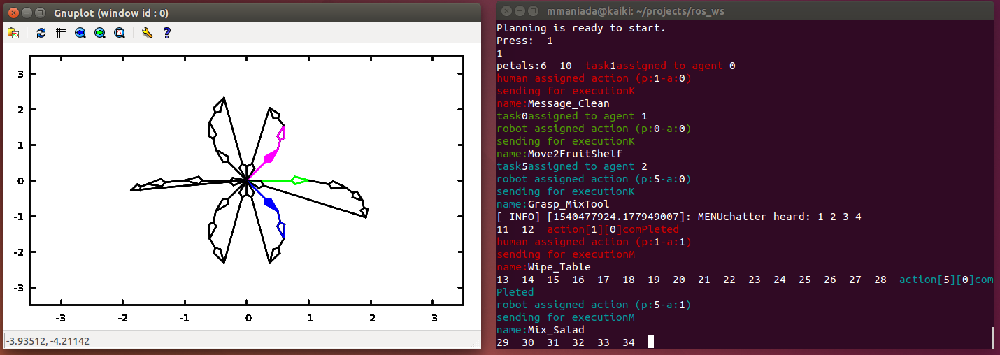

# README
Daisy Planner - Planning Time Informed Multi-agent Interactions*

The code is open-source (BSD License). Please note that this work is an on-going research and thus some parts are not fully developed yet. Furthermore, the code will be subject to changes in the future which could include greater re-factoring.

*EU H2020 FET Proactive Grant GA: 641100 TIMESTORM— Mind and Time: Investigation of the Temporal Traits of Human-Machine Convergence

## Getting Started
These instructions will get you a copy of the project up and running on your local machine for development and testing purposes.

## Prerequisites
* Ubuntu 14.04 and later
* ROS indigo and later

## Installing
* mkdir -p dp_ws/src && cd dp_ws/src
* git clone https://github.com/mrsp/daisy_planner.git 
* cd daisy_planner/daisy_plot
* git clone https://github.com/dstahlke/gnuplot-iostream.git
* catkin_make -DCMAKE_BUILD_TYPE=Release  --pkg timestorm_msg
* catkin_make -DCMAKE_BUILD_TYPE=Release 
* If you are using catkin tools run: catkin build  --cmake-args -DCMAKE_BUILD_TYPE=Release 

## ROS Examples
* roscore
* rosrun daisy_planner daisy_planner
* rosrun daisy_plot daisy_plot

